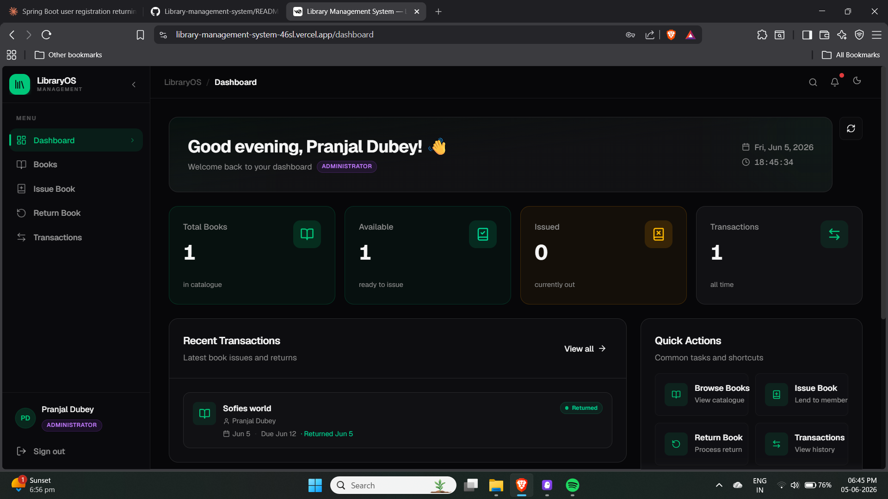
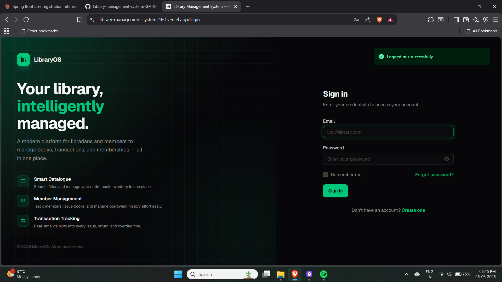
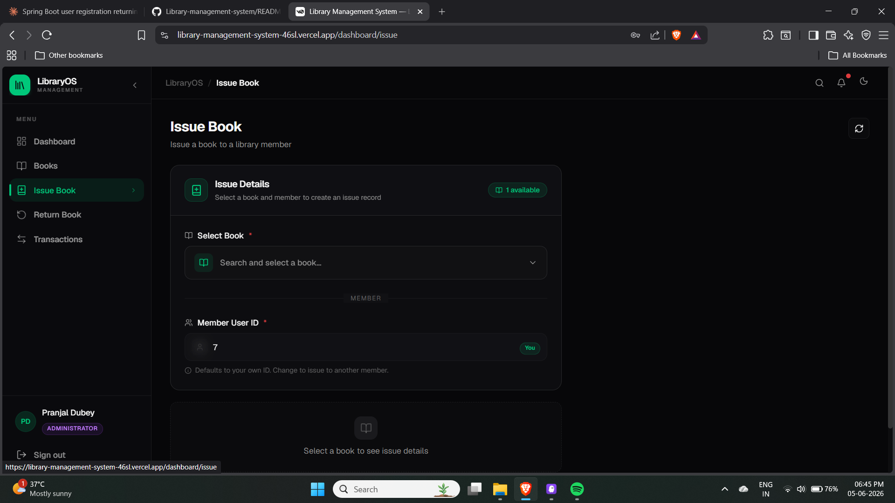
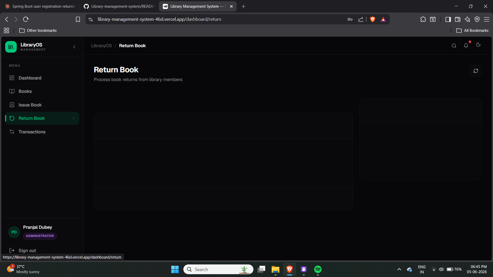
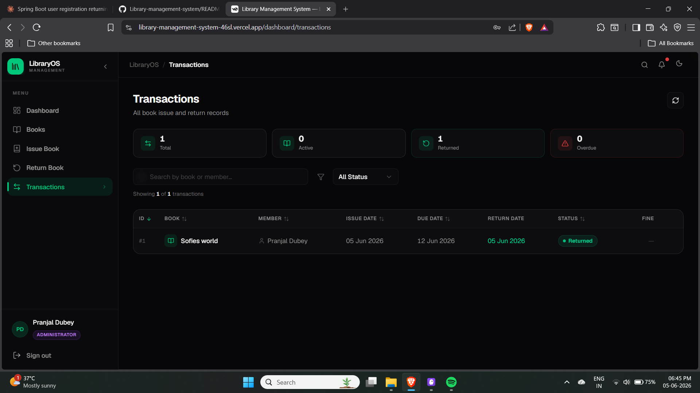

# 📚 LibraryOS — Library Management System

A full-stack, production-deployed library management platform with JWT 
authentication, role-based access control, book management, and 
transaction tracking.



---

## 🌐 Live Demo

- **Frontend**: https://library-management-system-46sl.vercel.app
- **Backend API (Swagger)**: https://library-management-system-production-1e10.up.railway.app/swagger-ui/index.html

> **Demo Credentials**
> | Role | Email | Password |
> |------|-------|----------|
> | Admin | pranjal@gmail.com | 123456 |

---

## 📸 Screenshots

### Login Page


### Dashboard


### Issue Book


### Return Book


### Transactions


---

## 🛠 Tech Stack

### Backend
| Technology | Purpose |
|------------|---------|
| Java 17 | Core language |
| Spring Boot 3.2 | Backend framework |
| Spring Security + JWT | Authentication & authorization |
| MySQL + Spring Data JPA | Database & ORM |
| Swagger (OpenAPI 3) | API documentation |
| Maven | Build tool |
| Railway | Deployment |

### Frontend
| Technology | Purpose |
|------------|---------|
| Next.js 14 + TypeScript | Frontend framework |
| Tailwind CSS + shadcn/ui | Styling & UI components |
| React Context API | State management |
| Native Fetch API | HTTP client |
| Vercel | Deployment |

---

## ✨ Features

### 🔐 Authentication & Authorization
- User registration & login with JWT tokens
- Role-based access control — ADMIN, LIBRARIAN, USER
- Protected routes with automatic session handling
- Auto redirect on token expiry

### 📚 Book Management
- Add, update, delete books (ADMIN/LIBRARIAN only)
- View full book catalogue (all authenticated users)
- Real-time availability tracking
- Unique ISBN validation

### 🔄 Transaction System
- Issue books to members
- Process book returns
- Fine calculation for late returns
- Full transaction history with filters
- Status tracking — Active, Returned, Overdue

### 🎨 UI/UX
- Dark mode interface
- Responsive design
- Real-time dashboard stats
- Quick action shortcuts

---

## 🏗 Architecture

```
┌─────────────────────┐         ┌──────────────────────┐
│   Next.js Frontend  │ ──────► │  Spring Boot Backend  │
│   (Vercel)          │  HTTPS  │  (Railway)            │
└─────────────────────┘         └──────────┬───────────┘
                                           │
                                 ┌─────────▼───────────┐
                                 │   MySQL Database     │
                                 │   (Railway)          │
                                 └─────────────────────┘
```

---

## 🔗 API Endpoints

### Auth
| Method | Endpoint | Access |
|--------|----------|--------|
| POST | `/auth/register` | Public |
| POST | `/auth/login` | Public |

### Books
| Method | Endpoint | Access |
|--------|----------|--------|
| GET | `/books` | Authenticated |
| GET | `/books/{id}` | Authenticated |
| POST | `/books` | ADMIN, LIBRARIAN |
| PUT | `/books/{id}` | ADMIN, LIBRARIAN |
| DELETE | `/books/{id}` | ADMIN, LIBRARIAN |

### Transactions
| Method | Endpoint | Access |
|--------|----------|--------|
| GET | `/transactions` | ADMIN, LIBRARIAN |
| POST | `/issue` | ADMIN, LIBRARIAN |
| POST | `/return` | ADMIN, LIBRARIAN |

---

## 🚀 Running Locally

### Prerequisites
- Java 17+
- Node.js 18+
- MySQL 8+

### Backend
```bash
cd backend

# Configure application.properties
spring.datasource.url=jdbc:mysql://localhost:3306/library_db
spring.datasource.username=your_username
spring.datasource.password=your_password
spring.jpa.hibernate.ddl-auto=update
app.jwt.secret=your-base64-encoded-secret

# Run
mvn spring-boot:run
```

### Frontend
```bash
cd frontend

# Install dependencies
npm install

# Configure env
echo "NEXT_PUBLIC_API_URL=http://localhost:8080" > .env.local

# Run
npm run dev
```

| Service | URL |
|---------|-----|
| Frontend | http://localhost:3000 |
| Backend | http://localhost:8080 |
| Swagger | http://localhost:8080/swagger-ui/index.html |

---

## 📁 Project Structure

```
Library-management-system/
├── backend/
│   └── src/main/java/com/library/
│       ├── controller/
│       ├── service/
│       ├── repository/
│       ├── entity/
│       ├── dto/
│       ├── security/
│       ├── exception/
│       └── config/
├── frontend/
│   ├── app/
│   ├── components/
│   ├── hooks/
│   ├── lib/
│   └── types/
├── screenshots/
│   ├── login.png
│   ├── dashboard.png
│   ├── issue.png
│   ├── return.png
│   └── transactions.png
└── README.md
```

---

## 👨‍💻 Author

**Pranjal Dubey**  
B.Tech Computer Science — Sitare University, Lucknow

[](https://github.com/Iampranjaldubey)

---

*Built with ❤️ — LibraryOS, 2026*