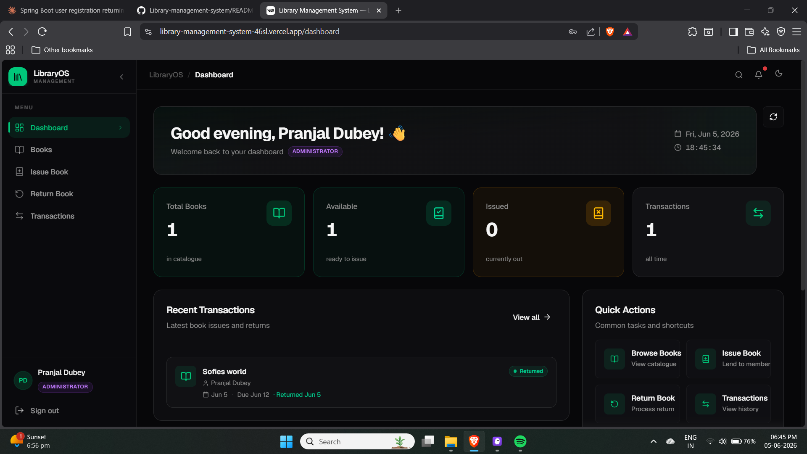
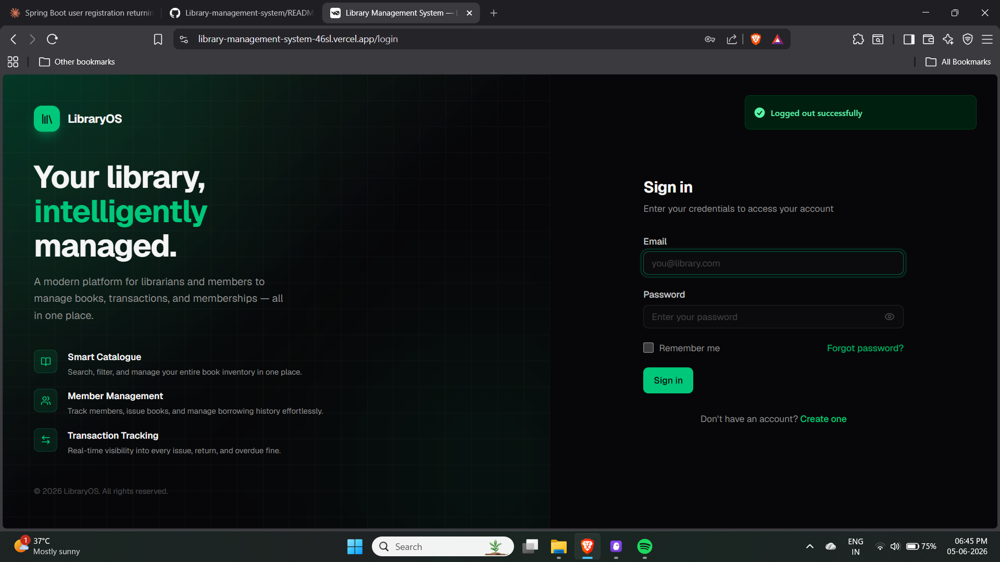
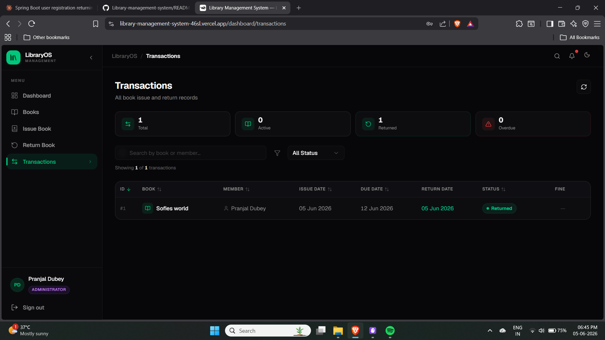

# 📚 LibraryOS — Full-Stack Library Platform

Concurrency-safe book circulation with JWT auth, refresh-token rotation, and a
one-command Docker stack. Spring Boot 3 + MySQL on the back, Next.js 16 +
TypeScript on the front.

[](https://github.com/Iampranjaldubey/Library-management-system/actions/workflows/ci.yml)




---

## 🌐 Live Demo

- **Frontend**: https://library-management-system-46sl.vercel.app
- **Backend API**: self-hostable in minutes — see [Deploy for free](#-deploy-for-free-render--aiven). _(The prior Railway free instance was retired when Railway ended its free plan.)_

> **Demo login** — Admin: `pranjal@gmail.com` / `123456`

### Or run the whole stack in one command

```bash
docker compose up --build
```

That's MySQL 8 + the Spring Boot API (Flyway-migrated, healthchecked). Swagger at
http://localhost:8080/swagger-ui.html. Then start the frontend with
`cd frontend && pnpm install && pnpm dev` (http://localhost:3000).

---

## 🧩 Engineering Highlights

The parts worth reading — each is small, tested, and defensible.

### Concurrency-safe circulation (the headline)
`issueBook` used to read → check availability → decrement → save with no locking,
so two requests for the last copy could both succeed and over-issue a book. A
[12-thread test](backend/src/test/java/com/library/service/TransactionConcurrencyTest.java)
reproduces it (10/12 succeed on the old code). The fix is **JPA optimistic locking**:
a `@Version` column on `Book` (Flyway
[V5](backend/src/main/resources/db/migration/V5__add_book_version_optimistic_lock.sql))
turns the update into `... WHERE id = ? AND version = ?`, and
[`issueBook`](backend/src/main/java/com/library/service/impl/TransactionServiceImpl.java)
retries the loser in a fresh `REQUIRES_NEW` transaction with bounded backoff.
Rejected alternatives (pessimistic `SELECT ... FOR UPDATE`, atomic conditional
`UPDATE`) are documented inline.

### Refresh-token rotation with reuse detection
The refresh token lives in an **HttpOnly, SameSite, Secure-configurable cookie**
(never in the JSON body or `localStorage`, so XSS can't read it). Every `/refresh`
[rotates](backend/src/main/java/com/library/service/impl/RefreshTokenServiceImpl.java)
the token; replaying a rotated token is detected as **reuse** and revokes the
user's entire token family. The Next.js app puts the API behind a **same-origin
proxy** so the cookie is first-party. Full flow is
[integration-tested](backend/src/test/java/com/library/controller/AuthRefreshTokenFlowTest.java).

### Testing against real MySQL, in CI
Integration tests run the actual Flyway migrations against a
[Testcontainers MySQL](backend/src/test/java/com/library/integration/) instance
with `ddl-auto=validate`, proving the schema and JPA entities agree — something the
H2 unit profile can't. [GitHub Actions](.github/workflows/ci.yml) runs the backend
(`mvnw verify`, JaCoCo gate), the frontend (type-check + Vitest + build), and a
Docker image build on every push.

### PDF receipts
`GET /api/v1/transactions/{id}/receipt` streams a printable
[OpenPDF receipt](backend/src/main/java/com/library/service/impl/ReceiptServiceImpl.java);
the transactions UI downloads it as a blob.

---

## 📸 Screenshots

| Login | Dashboard | Transactions |
|-------|-----------|--------------|
|  |  |  |

---

## 🛠 Tech Stack

**Backend** — Java 17, Spring Boot 3.2, Spring Security 6 + JWT, Spring Data JPA,
MySQL 8, Flyway migrations, OpenPDF, springdoc/OpenAPI, Maven (wrapper).

**Frontend** — Next.js 16 (App Router) + React 19 + TypeScript, Tailwind CSS +
shadcn/ui, React Context, native fetch.

**Testing / infra** — JUnit 5, Mockito, Testcontainers (MySQL), JaCoCo, Vitest +
React Testing Library, Docker + Docker Compose, GitHub Actions CI, deployed on
Railway (API) + Vercel (web).

---

## 🏗 Architecture

```
┌──────────────────────┐   same-origin /api/*   ┌───────────────────────┐
│   Next.js (Vercel)   │ ─────── proxy ───────► │  Spring Boot (Railway) │
│   React 19 + TS      │                        │  Security 6 · JPA      │
└──────────────────────┘                        └───────────┬───────────┘
   access token: bearer header                              │ Flyway
   refresh token: HttpOnly cookie                 ┌─────────▼───────────┐
                                                  │   MySQL 8 (Railway)  │
                                                  └─────────────────────┘
```

The frontend never calls the backend cross-origin: it hits `/api/*` on its own
origin and Next proxies to the API, which keeps the refresh cookie first-party.

---

## 🔗 Key API Endpoints

| Method | Endpoint | Access |
|--------|----------|--------|
| POST | `/api/v1/auth/register`, `/login` | Public |
| POST | `/api/v1/auth/refresh`, `/logout` | Cookie |
| GET | `/api/v1/books`, `/books/{id}` | Authenticated |
| POST/PUT/DELETE | `/api/v1/books`, `/books/{id}` | ADMIN, LIBRARIAN |
| POST | `/api/v1/issue`, `/return` | ADMIN, LIBRARIAN |
| GET | `/api/v1/transactions`, `/transactions/{id}/receipt` | ADMIN, LIBRARIAN |

Full contract in Swagger (`/swagger-ui.html`).

---

## 🚀 Running Locally

### One command (recommended)
```bash
docker compose up --build      # MySQL + backend
cd frontend && pnpm install && pnpm dev
```

### Manual backend (JDK 17 + MySQL)
```bash
cd backend
# Env: DB_URL, DB_USERNAME, DB_PASSWORD, JWT_SECRET (base64, >32 bytes)
./mvnw spring-boot:run
```
Schema is managed by **Flyway** (`ddl-auto=validate`) — no `ddl-auto=update`.

---

## 🚀 Deploy for free (Render + Aiven)

The frontend runs on Vercel; the API is a Docker service and the DB is MySQL. A free setup:

1. **Database — [Aiven for MySQL](https://aiven.io/free-mysql-database)** (free, no card). Create a MySQL service and note host/port/db/user/password. Your `DB_URL` is `jdbc:mysql://<host>:<port>/<database>?ssl-mode=REQUIRED`.
2. **API — [Render](https://render.com) (Docker, free).** This repo ships a [`render.yaml`](render.yaml) blueprint: in Render, **New → Blueprint** and pick this repo. Set the prompted secrets — `DB_URL`, `DB_USERNAME`, `DB_PASSWORD`, `JWT_SECRET` (`openssl rand -base64 48`), `FRONTEND_URL`. Flyway migrates on first boot; the health check is `/api/v1/health`. (Free services sleep after ~15 min idle and cold-start in ~1 min.)
3. **Frontend — Vercel.** Add `BACKEND_API_URL` = your Render URL as a **Production** environment variable, then redeploy (Next bakes the proxy target at build time, so it must be set before the build). The app proxies `/api/*` same-origin (`next.config.mjs`), so the HttpOnly refresh cookie stays first-party across the Vercel → Render hop.
4. Update the demo links above once the API URL is stable.

Full env reference: [`backend/.env.example`](backend/.env.example).

---

## ✅ Testing

```bash
# Backend: unit + integration + coverage gate (JaCoCo report at target/site/jacoco)
cd backend && ./mvnw verify        # Testcontainers MySQL tests need Docker

# Frontend
cd frontend && pnpm test:run
```

Backend instruction coverage is ~66%, gated in CI (JaCoCo, `mvnw verify`). Beyond the
raw number, the meaningful coverage is the concurrency race, the auth/rotation/reuse
flow, migration-vs-entity validation on real MySQL, the service layer (books, users,
fines), and PDF generation. Load/Lighthouse harness lives in [`perf/`](perf/README.md).

---

## 📁 Project Structure

```
Library-management-system/
├── backend/          Spring Boot API (controller/service/repository/entity/dto/security)
│   └── src/main/resources/db/migration/   Flyway V1–V5
├── frontend/         Next.js app (app/ components/ hooks/ lib/ context/ __tests__/)
├── perf/             k6 load test + Lighthouse harness
├── .github/workflows/ci.yml
├── docker-compose.yml
└── screenshots/
```

---

## 👨‍💻 Author

**Pranjal Dubey** — B.Tech Computer Science, Sitare University

[](https://github.com/Iampranjaldubey)

*Built as a depth-over-breadth portfolio project — see [RESUME_PROJECT_PLAN.md](RESUME_PROJECT_PLAN.md).*
